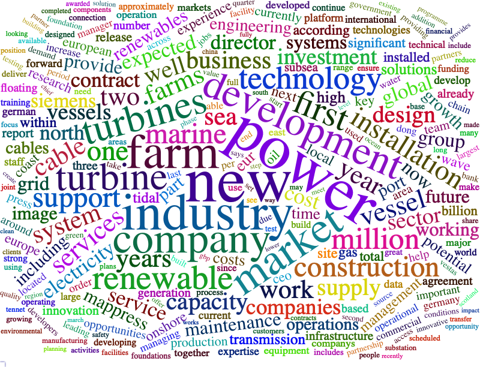
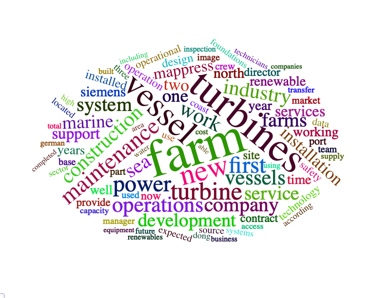
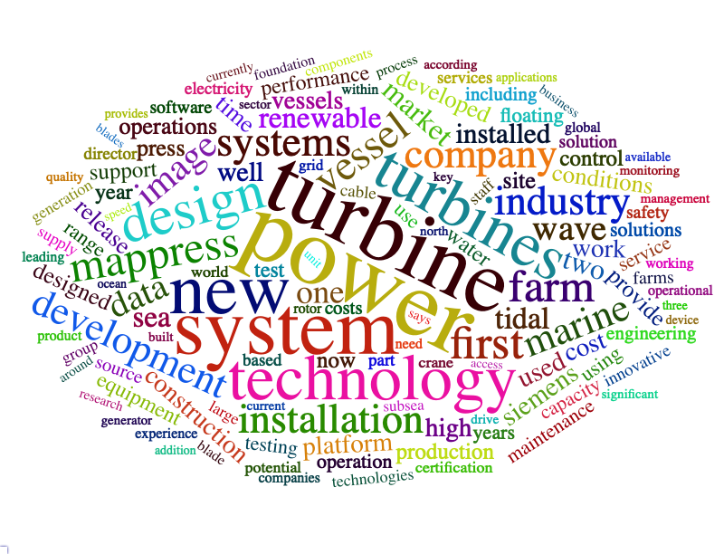
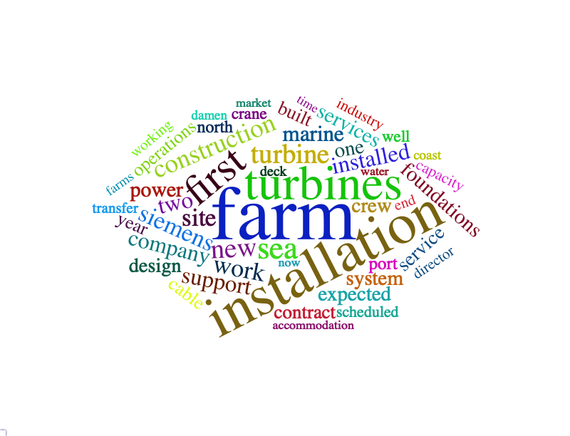
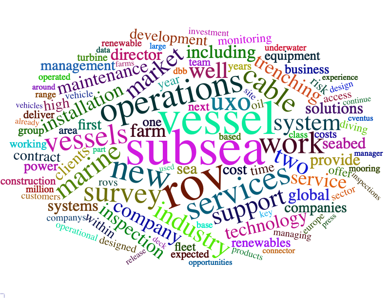
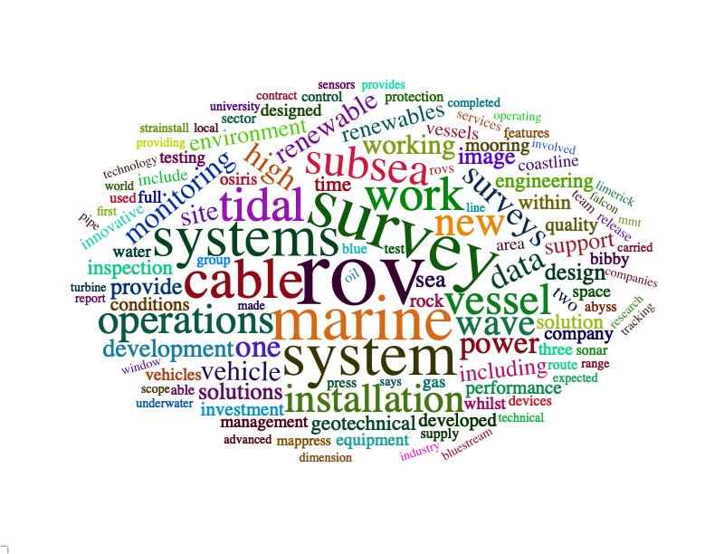
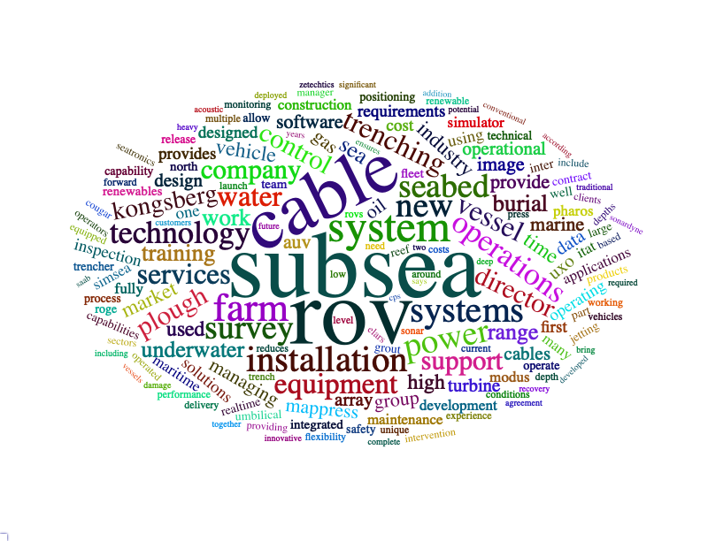

<hr>

```{r results='hide', message=FALSE, warning=FALSE, echo=F}
# Formating Codes.  Do not change the codes in this chunk !!
rm(list=ls(all=T))
knitr::opts_chunk$set(comment = NA)
knitr::opts_knit$set(global.par = TRUE)
par(cex=0.8)
options(scipen=20, digits=5, width=80)
if(!require(pacman)) install.packages("pacman")
```

```{r eval=F}
# only need to execute once !!!
install.packages("webshot")
webshot::install_phantomjs()
```

```{r results='hide', message=FALSE, warning=FALSE}
pacman::p_load(dplyr, ggplot2, tm, SnowballC, wordcloud2, RColorBrewer, 
               plotly, stringr, d3heatmap, htmlwidgets)
```

<br>

### 【A】News Article Corpus Summary
```{r}
load("data/X.rdata")
```

```{r}
summary(X)
```

```{r}
par(cex=0.8, mar=c(6,4,4,2))
hist(X$date, "year", freq=T, main="No. Articles per Year", las=2, xlab="")
```

```{r}
par(cex=0.8, mar=c(4,12,4,2))
table(X$sub) %>% sort %>% 
  barplot(las=2, horiz=T, main="No. Articles per Subject", xlab="freq")
```


```{r message=FALSE, warning=FALSE, fig.height=6, fig.width=9.5}
X %>% 
  mutate(year = as.integer(format(date,"%Y"))) %>% 
  group_by(year, sub) %>% count %>% 
  ggplot(aes(x=year, y=n, fill=sub)) + 
  geom_bar(stat="identity", position="fill") +
  scale_x_continuous(breaks=2009:2019) -> p
ggplotly(p)
```

<br><hr>

### 【B】Wordcloud by Subject

```{r message=FALSE, warning=FALSE, fig.height=6, fig.width=9.5}
stops = c(
  stopwords("en"), "offshore", "wind", "energy", "will", 
  "said", "also", "can")

WC = function(subject, output, ROV=FALSE, min.freq=25, ...) {
  X1 = X %>% filter(sub == subject)
  if(ROV) X1 = subset(X1, str_count(text, "ROV|ROUV")>0)
  txt = iconv(X1$text, "latin1", "ASCII", sub="")
  docs <- Corpus(VectorSource(txt))
  docs <- tm_map(docs, content_transformer(tolower)) 
  docs <- tm_map(docs, removeNumbers)     # 
  docs <- tm_map(docs, removeWords,stops) # 
  docs <- tm_map(docs, removePunctuation) # 
  docs <- tm_map(docs, stripWhitespace)   # 

  dtm <- TermDocumentMatrix(docs)
  m <- as.matrix(dtm)
  v <- sort(rowSums(m),decreasing=TRUE)
  d<- data.frame(word=names(v), freq=v)
  hw = wordcloud2(subset(d, freq > min.freq), ... )
  saveWidget(hw,"temp.html",selfcontained = F)
  webshot::webshot("temp.html",output,vwidth=800, vheight=600, delay=20)
  }
```


##### Business & Finance
```{r eval=F}
WC("Business & Finance", "png/1.png", ROV=F, min.freq=200, size=0.6) 
```



<br><hr>

##### R&D


<br><hr>
##### Operations & Maintenance



<br><hr>
##### Technology



<br><hr>
##### Vessels



<br><br><br><hr>

### 【C】ROV 

```{r}
X$rov = str_count(X$text, " ROV| ROUV")
rx = xtabs(rov ~ sub + format(date, "%Y"), X) 
rx
```


```{r message=FALSE, warning=FALSE, fig.height=6, fig.width=9.5}
rx %>% as.data.frame.matrix %>% d3heatmap(T,F, col="Greens")
```


<br><hr>

##### ROV: Business & Finance


<br><hr>
##### ROV: R&D



<br><hr>
##### ROV: Operations & Maintenance


<br><hr>
##### ROV: Technology


<br><hr>
##### ROV: Vessels


<br><br>

<br><br><br><hr>


