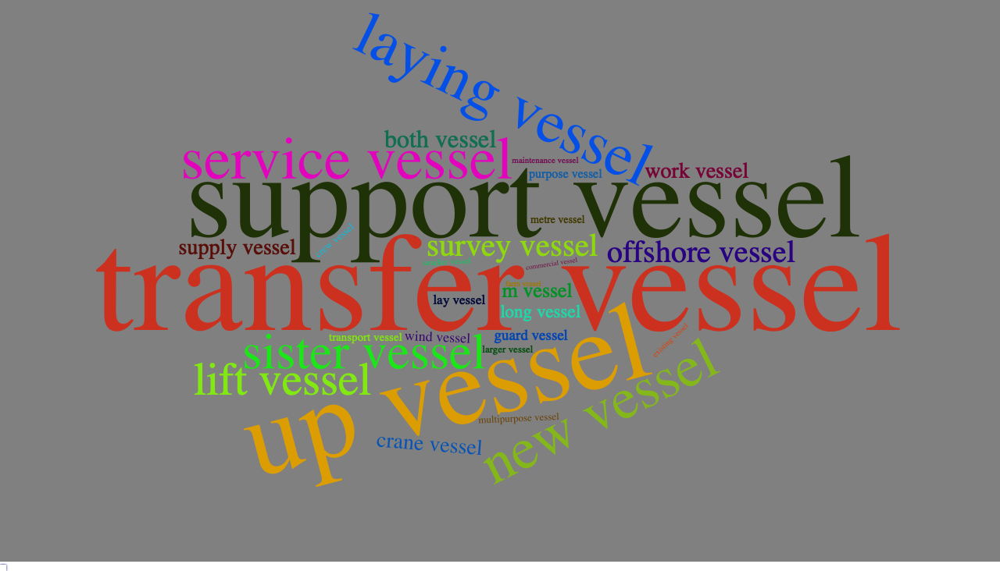
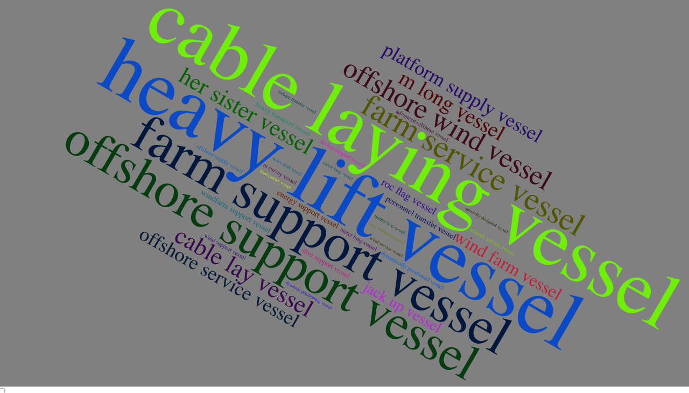
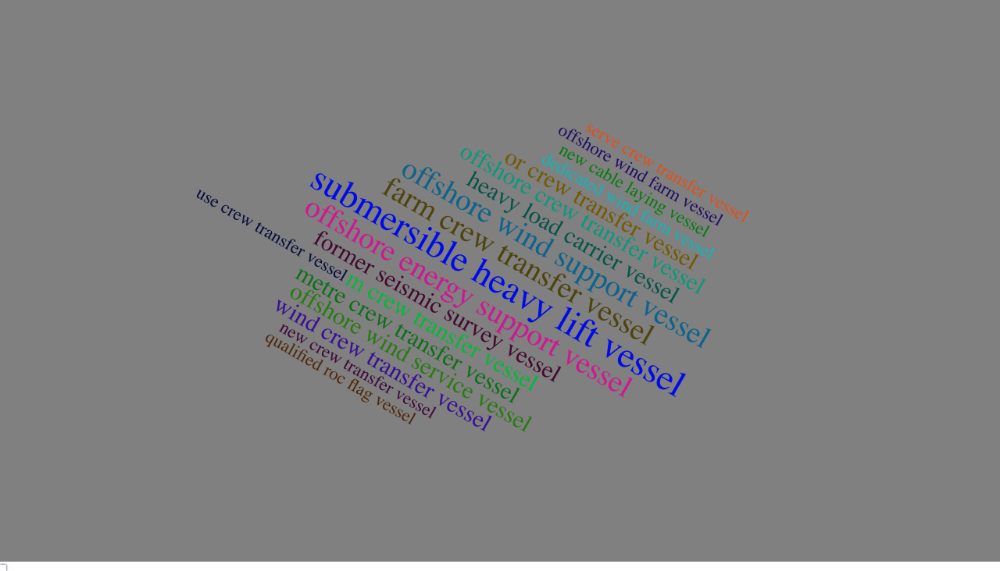

```{r results='hide', message=FALSE, warning=FALSE, echo=F}
# Formating Codes.  Do not change the codes in this chunk.<br>
### setwd("C:/1/G/osw")
rm(list=ls(all=T))
pacman::p_load(readr, dplyr, ggplot2, stringr,wordcloud2, RColorBrewer,htmlwidgets)
load("data/X.rdata")

```

<br><hr>

### 【A】filter words

```{r}
filters = "s |a |of |the |this |to |on |from |for |and |in |first |second |third |these |their |one |two |three |four |any |other |with |our |other "
```

```{r}
bigram = X$text %>% tolower %>% 
  str_extract_all("[a-z]+ [V|v]essel") %>% 
  unlist %>% table %>% sort(dec=T)
bigram[!str_detect(names(bigram), filters)] %>% {.[.>10]}

```
<br>

### 【B】Wordcloud for bigram



<br><hr>

```{r}
trigram = X$text %>% tolower %>% 
  str_extract_all("[a-z]+ [a-z]+ [V|v]essel") %>% 
  unlist %>% table %>% sort(dec=T)
trigram[!str_detect(names(trigram), filters)] %>% {.[.>5]}
```

<br>

### 【C】Wordcloud for trigram


<br><hr>

```{r}
quogram = X$text %>% tolower %>% 
  str_extract_all("[a-z]+ [a-z]+ [a-z]+ [V|v]essel") %>% 
  unlist %>% table %>% sort(dec=T)
quogram[!str_detect(names(quogram), filters)] %>% {.[.>2]}
```
<br>

### 【D】Wordcloud for quogram



<br><br>

<br><br><br><hr>


